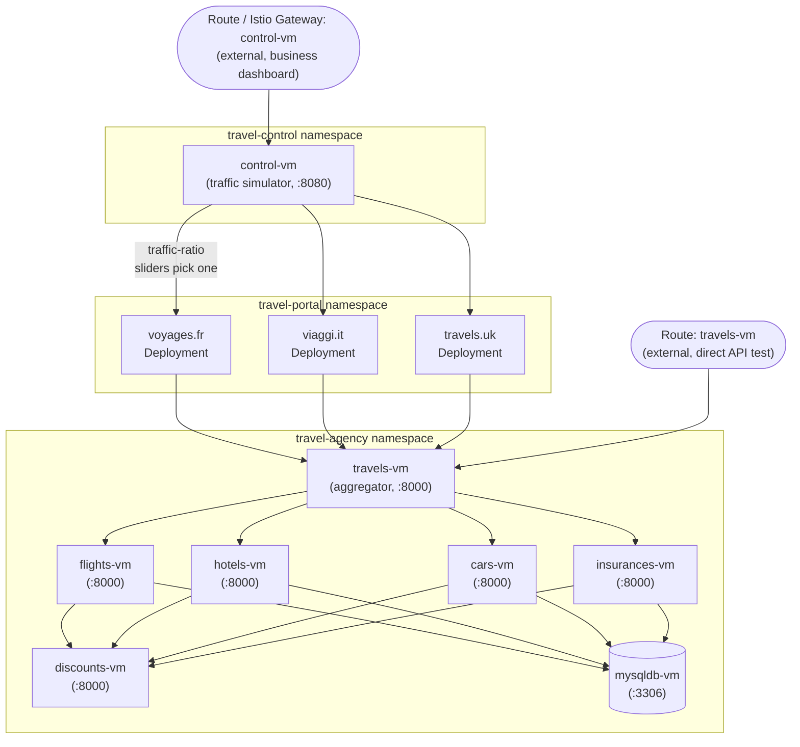

# OpenShift Virtualization + Service Mesh + GitOps — Travel Agency Lab

A from-scratch, deployable implementation of the RHPDS *"OpenShift Virtualization with Service Mesh and GitOps"* travel-agency lab. Unlike the official lab — which runs on RHPDS-provisioned infrastructure with the VMs, operators, and namespaces already in place — this repo builds all of that from an empty cluster, then walks through the same 6 modules.

Source lab: https://rhpds.github.io/virt-ossm-showroom/modules/main/intro/intro.html
Upstream demo app: https://kiali.io/docs/tutorials/travels/ (images: `quay.io/kiali/demo_travels_*`)

## Architecture

Each VM (`module-0-bootstrap/vms/`) is a plain Fedora guest running one app container via a Podman Quadlet (`cars.service`, `travels.service`, etc. — see [module-0's README](module-0-bootstrap/README.md#how-the-vms-run-their-app-container)). The arrows below are calls made over the Kubernetes `Service` hostnames that [Module 1](module-1-explore-vms/README.md) creates for each VM's `virt-launcher` pod.



- **Flow A — direct API test**: external Route → `travels-vm` directly (Module 1), bypassing the storefronts/dashboard entirely.
- **Flow B — business dashboard**: external Route (Module 2) or Istio Gateway (Module 4) → `control-vm` → one storefront (`voyages.fr`/`viaggi.it`/`travels.uk`, chosen per the dashboard's traffic-ratio sliders) → `travels-vm`.
- `travels-vm` is the aggregator — no data of its own, just fans out to `flights-vm`/`hotels-vm`/`cars-vm`/`insurances-vm` and merges their responses into one quote.
- `flights-vm`, `hotels-vm`, `cars-vm`, `insurances-vm` each call `discounts-vm` and read/write `mysqldb-vm`.
- `discounts-vm` and `mysqldb-vm` are leaf nodes — nothing downstream of them.
- Not shown: the mesh sidecars, canary (`cars-vm-v2-a`/`-b`) routing, and authz policies added in modules 3–4, and the GitOps layer (ArgoCD) that manages all of this from Module 5 on.

## How this differs from the official lab

The official lab's Module 1 assumes the `travel-agency` namespace and its VMs are already running. This repo adds **Module 0** to stand that up first — namespaces, the 7 travel-agency VMs, and the 3 travel-portal containers — using the exact same images, env vars, and cloud-init/VM patterns the rest of the lab already establishes in modules 2–5, cross-checked against the upstream `kiali/demos` repo's `travel_agency.yaml` / `travel_portal.yaml` / `travel_control.yaml`.

Everything here is **generated and reviewed manifest/code — none of it has been applied against a live cluster yet.** Validate module by module before trusting it in a real environment.

## Prerequisites

- OpenShift cluster, cluster-admin access
- OpenShift Virtualization — already installed on this build's target cluster (not covered by this repo)
- OpenShift GitOps — already installed and already in use on this build's target cluster, with an existing `openshift-gitops` ArgoCD instance (not covered by this repo)
- OpenShift Service Mesh 3.4 (Sail Operator/Istio-native), Kiali, Grafana, distributed tracing (OpenTelemetry + Tempo) — still need installing here; via `common/operators/` (see that folder's README)

## Layout

```
common/operators/            cluster-admin prerequisites (see common/operators/README.md)
module-0-bootstrap/          stands up travel-agency VMs + travel-portal containers (not in the official lab)
module-1-explore-vms/        Services, Routes, NetworkPolicy for the VMs
module-2-scale-vms/          business dashboard VM, vertical/horizontal scaling
module-3-service-mesh-observability/   join the mesh, Kiali/Grafana/tracing (Tempo)
module-4-traffic-resilience-security/  ingress gateway, canary release, circuit breaker, authz policies
module-5-gitops/             ArgoCD-managed deployment of everything above
module-6-self-service-provisioning/    Developer Hub self-service (documentation only — deferred, see that module's README)
```

## Order of execution

Run modules 0 through 5 in order — each depends on resources created by the previous one. Module 6 is reference documentation only in this pass.

```sh
oc apply -f common/operators/00-namespaces.yaml
oc apply -f common/operators/20-service-mesh.yaml
# wait for the Sail/Kiali/OpenTelemetry/Tempo/Grafana operators to finish installing, then:
oc apply -f common/operators/21-istio.yaml
oc apply -f common/operators/22-istiocni.yaml
# wait for Istio/IstioCNI to reach Ready, then:
oc apply -f common/operators/23-peer-authentication.yaml
oc apply -f common/operators/24-kiali.yaml
oc apply -f common/operators/25-grafana.yaml
oc apply -f common/operators/26-tempo.yaml
oc apply -f common/operators/27-otel-collector.yaml

# then work through each module's README.md in order:
#   module-0-bootstrap/README.md
#   module-1-explore-vms/README.md
#   module-2-scale-vms/README.md
#   module-3-service-mesh-observability/README.md
#   module-4-traffic-resilience-security/README.md
#   module-5-gitops/README.md
```

Each module's `README.md` has the exact commands to deploy and verify that module before moving to the next.
